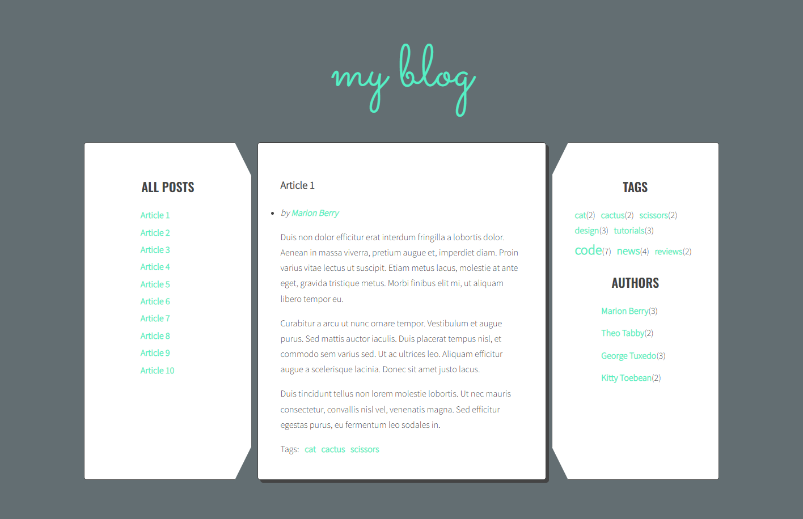

# English

## Responsive Blog Website

This is an example of a blog-type website built with Responsive Web Design (RWD).
The main goal of this project was to create a simple blog interface where content does not need to reload when switching between articles, while fully supporting RWD.

### Main features
- Tag list with dynamic font sizes based on tag usage count
- Author list
- Post list with article navigation without page reload

### Built with
- HTML
- SCSS / CSS
- JavaScript

### Requirements
- Node.js (tested on v24.12.0, Windows)
- Git (tested on v2.52.0, Windows)

### How to run the project
```bash
npm run init-project
npm run watch
```
### Website screanshoot:
